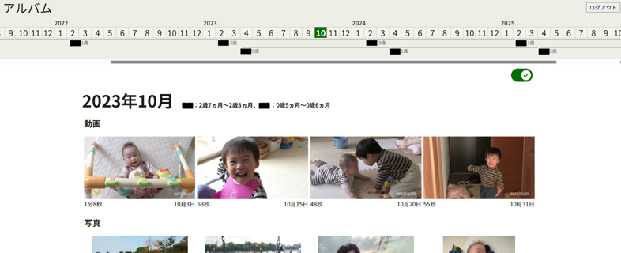
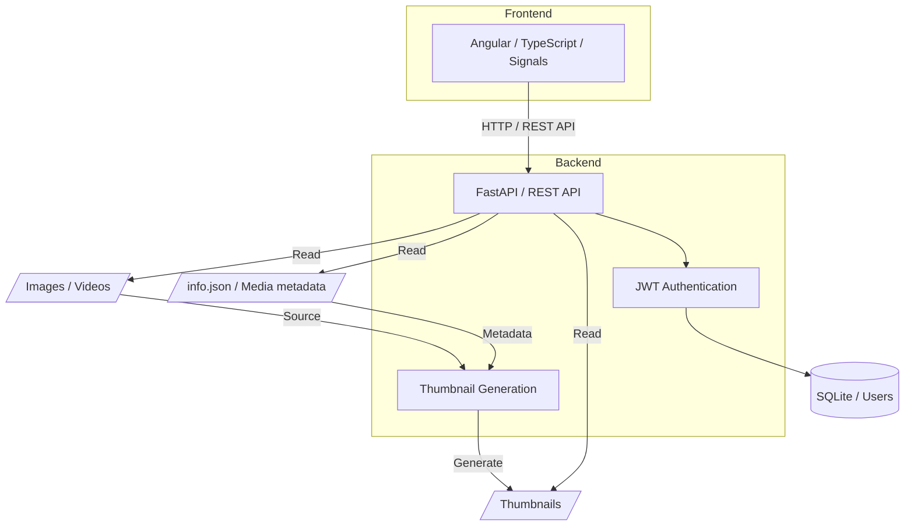

# アルバム

子どもの成長を記録するアルバムアプリです。



## 機能

- ユーザー認証
- 画像・動画の表示
- 月別・タグ別のフィルタリング
- お気に入り管理

## システム構成



## セットアップ

### 1. バックエンド

- [uvをインストール](https://docs.astral.sh/uv/getting-started/installation/)

- 必要なライブラリをインストール

    ```bash
    cd backend
    uv sync
    ```

- 秘密鍵を生成

    ```bash
    uv run python -c "import secrets; print(secrets.token_hex(32))"
    ```

- `backend` ディレクトリに `.env`ファイルを作成し、生成した秘密鍵を設定

    ```env
    SECRET_KEY=your-generated-secret-key
    ```

    例：

    ```env
    SECRET_KEY=0123456789abcdef0123456789abcdef0123456789abcdef0123456789abcdef
    ```

    `.env` はGitにコミットしないでください。

- ユーザの作成
    
    ```bash
    cd backend
    uv run python -m scripts.create_user
    ```

- (オプション) 作成したユーザの確認

    ```bash
    cd backend
    uv run python -m scripts.list_users
    ```

- メディアファイルと設定ファイルを配置

    ```
    backend/
    └── assets/
        ├── media/
        │   ├── yyyymmdd*.mp4
        │   └── yyyymmdd*.jpeg
        └── info.json
    ```


    メディアファイルを`backend/assets/media/`に配置します。ファイル名は yyyymmdd (Ex: `20260612-1.mp4`)で始まる必要があります。ファイル名で、撮影日を判断しています。
    また、メディアのメタデータ情報を記載した `info.json` を`backend/assets/`に配置します。`info.json`の書き方は`backend/samples/info.json`を参考のこと。`backend/samples/`にはメディアファイルのサンプルも格納しています。


### 2. フロントエンド

- [Node.jsをインストール](https://nodejs.org/)

- 必要なライブラリをインストール

    ```bash
    cd frontend
    npm install
    ```

## 起動方法

### 1. バックエンド

```bash
cd backend
uv run main.py
```

### 2. フロントエンド

```bash
cd frontend
npm start
```

ブラウザから`http://localhost:4200/`へアクセス